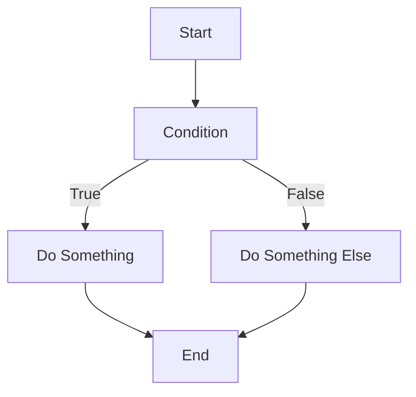

<show-structure for="chapter,procedure" depth="1"/>

# Conditionals


## Overview

### Definition

<table>
<tr>
<td>
<note>Conditional statements are essential programming constructs that allow us to make decisions based on certain conditions. These statements evaluate an expression and execute specific code blocks based on whether the condition is true or false. The most common conditional statements are `if`, `else if`, `else`, nested `if`, and `switch`.</note>
</td>
<td>



</td>
</tr>
</table>


### Use Cases

<table style="none">
<tr>
<td>

Decision-making
: Executing different code based on specific conditions.

</td>
<td>

Input Validation
: Checking user input for validity before processing it.

</td>
<td>

Flow Control
: Controlling program flow based on conditions.

</td>
</tr>
<tr>
<td>

Error Handling
: Handling specific error conditions.

</td>
<td>


</td>
<td>

Menu Selection
: Implementing menu-driven applications.

</td>
</tr>

</table>


### Pros & Cons

<table>
<tr>
<th>Pros</th>
<th>Cons</th>
</tr>
<tr>
<td>
<deflist collapsible="true">
    <def title="Improved Control" collapsible="true" default-state="collapsed">
        Allows the program to make dynamic decisions during runtime.
    </def>
    <def title="Readable Code" collapsible="true" default-state="collapsed">
        Conditional statements enhance code readability by expressing intent clearly.
    </def>
    <def title="Saves Resources" collapsible="true" default-state="collapsed">
        Prevents unnecessary execution of code, optimizing resource utilization.
    </def>
</deflist>
</td>
<td>
<deflist collapsible="true">
    <def title="Complexity" collapsible="true" default-state="collapsed">
        Multiple nested conditions can make code harder to maintain and understand.
    </def>
    <def title="Code Duplication" collapsible="true" default-state="collapsed">
        Repeating code blocks for similar conditions can lead to code duplication.
    </def>
    <def title="Potential Bugs" collapsible="true" default-state="collapsed">
        Incorrect conditions or missing cases can introduce bugs.
    </def>
</deflist>
</td>
</tr>
</table>


## If-else Statement

<procedure switcher-key="Pseudocode">
<b>Pseudocode</b>

```text

<video src="https://youtu.be/osuzDDlBmRI?feature=shared" preview-src="if-else-statement-syntax.png" width="900"/>

```text
if some condition is met, do something
if not met, do something else
```

</procedure>

<procedure switcher-key="C++">
<b>C++</b>

<video src="https://youtu.be/TOx3tPJircc?feature=shared" preview-src="if-else-statement-syntax.png" width="900"/>

Sample code

``` c++
#include <iostream>
using namespace std;

int main() {
    int exam_score;
    int passing_threshold = 60;

    cout << "Enter your exam score: ";
    cin >> exam_score;

    if (exam_score >= passing_threshold) {
        cout << "Congratulations! You passed the exam." << endl;
    } else {
        cout << "Unfortunately, you did not pass the exam. Please try again." << endl;
    }

    return 0;
}
```

<br/>

```text
// Output

Enter your exam score: 75
Congratulations! You passed the exam.

```
{ collapsible="true" }

</procedure>

<procedure switcher-key="Python">
<b>Python</b>

<video src="https://youtu.be/NkVSSMt-h3Y?feature=shared" preview-src="if-else-statement-syntax.png" width="900"/>


``` python
passing_threshold = 60

exam_score = int(input("Enter your exam score: "))

if exam_score >= passing_threshold:
    print("Congratulations! You passed the exam.")
else:
    print("Unfortunately, you did not pass the exam. Please try again.")
```

<br/>

```text
# Output

Enter your exam score: 75
Congratulations! You passed the exam.

```
{ collapsible="true" }

</procedure>

<procedure switcher-key="Java">
<b>Java</b>

<video src="https://youtu.be/P6ivQ3QRq0I?feature=shared" preview-src="if-else-statement-syntax.png" width="900"/>


``` java
import java.util.Scanner;

public class Main {
    public static void main(String[] args) {
        Scanner scanner = new Scanner(System.in);
        int passing_threshold = 60;

        System.out.print("Enter your exam score: ");
        int exam_score = scanner.nextInt();

        if (exam_score >= passing_threshold) {
            System.out.println("Congratulations! You passed the exam.");
        } else {
            System.out.println("Unfortunately, you did not pass the exam. Please try again.");
        }
    }
}
```

<br/>

```text
// Output

Enter your exam score: 75
Congratulations! You passed the exam.

```
{ collapsible="true" }

</procedure>


<procedure switcher-key="Go">
<b>Go</b>

<video src="https://youtu.be/Hjqjff490B8?feature=shared" preview-src="if-else-statement-syntax.png" width="900"/>

``` go
package main

import (
    "fmt"
)

func main() {
    var passing_threshold int = 60
    var exam_score int

    fmt.Print("Enter your exam score: ")
    fmt.Scan(&exam_score)

    if exam_score >= passing_threshold {
        fmt.Println("Congratulations! You passed the exam.")
    } else {
        fmt.Println("Unfortunately, you did not pass the exam. Please try again.")
    }
}
```

<br/>

```text
// Output

Enter your exam score: 75
Congratulations! You passed the exam.

```
{ collapsible="true" }

</procedure>


## Switch / Match Statement

<procedure switcher-key="Pseudocode">
<b>Pseudocode</b>

<video src="https://youtu.be/osuzDDlBmRI?feature=shared" preview-src="switch-statement-syntax.png" width="900"/>

```text
condition to be met
    case (validation condition 1)
        // do something
    case (validation condition 2)
        // do something
    case (validation condition ...)
        // do something
    default
        // do this when no other conditions are met
```

</procedure>

<procedure switcher-key="C++">
<b>C++</b>

<video src="https://youtu.be/TOx3tPJircc?feature=shared" preview-src="switch-statement-syntax.png" width="900"/>

``` c++
#include <iostream>
using namespace std;

int main() {
    int day_number;

    cout << "Enter a day number (1 to 7): ";
    cin >> day_number;

    switch (day_number) {
        case 1:
            cout << "Sunday" << endl;
            break;
        case 2:
            cout << "Monday" << endl;
            break;
        case 3:
            cout << "Tuesday" << endl;
            break;
        case 4:
            cout << "Wednesday" << endl;
            break;
        case 5:
            cout << "Thursday" << endl;
            break;
        case 6:
            cout << "Friday" << endl;
            break;
        case 7:
            cout << "Saturday" << endl;
            break;
        default:
            cout << "Invalid day number. Please enter a number between 1 and 7." << endl;
            break;
    }

    return 0;
}
```

<br/>

```text
// Output

Enter a day number (1 to 7): 3
Tuesday

```
{ collapsible="true" }

</procedure>


<procedure switcher-key="Python">
<b>Python</b>

<video src="https://youtu.be/NkVSSMt-h3Y?feature=shared" preview-src="switch-statement-syntax.png" width="900"/>

[//]: # (``` python)

[//]: # ()
[//]: # (```)

``` python
day_number = int(input("Enter a day number (1 to 7): "))
day_name = ""

if day_number == 1:
    day_name = "Sunday"
elif day_number == 2:
    day_name = "Monday"
elif day_number == 3:
    day_name = "Tuesday"
elif day_number == 4:
    day_name = "Wednesday"
elif day_number == 5:
    day_name = "Thursday"
elif day_number == 6:
    day_name = "Friday"
elif day_number == 7:
    day_name = "Saturday"
else:
    day_name = "Invalid day number. Please enter a number between 1 and 7."
    
print(day_name)
```

<br/>

```text
# Output

Enter a day number (1 to 7): 3
Tuesday

```
{ collapsible="true" }

</procedure>


<procedure switcher-key="Java">
<b>Java</b>

<video src="https://youtu.be/P6ivQ3QRq0I?feature=shared" preview-src="switch-statement-syntax.png" width="900"/>

``` java
import java.util.Scanner;

public class Main {
    public static void main(String[] args) {
        Scanner scanner = new Scanner(System.in);
        int day_number;

        System.out.print("Enter a day number (1 to 7): ");
        day_number = scanner.nextInt();

        switch (day_number) {
            case 1:
                System.out.println("Sunday");
                break;
            case 2:
                System.out.println("Monday");
                break;
            case 3:
                System.out.println("Tuesday");
                break;
            case 4:
                System.out.println("Wednesday");
                break;
            case 5:
                System.out.println("Thursday");
                break;
            case 6:
                System.out.println("Friday");
                break;
            case 7:
                System.out.println("Saturday");
                break;
            default:
                System.out.println("Invalid day number. Please enter a number between 1 and 7.");
                break;
        }
    }
}
```

<br/>

```text
// Output

Enter a day number (1 to 7): 3
Tuesday

```
{ collapsible="true" }

</procedure>

<procedure switcher-key="Go">
<b>Go</b>

<video src="https://youtu.be/Hjqjff490B8?feature=shared" preview-src="switch-statement-syntax.png" width="900"/>

``` go
package main

import (
    "fmt"
)

func main() {
    var day_number int

    fmt.Print("Enter a day number (1 to 7): ")
    fmt.Scan(&day_number)

    switch day_number {
    case 1:
        fmt.Println("Sunday")
    case 2:
        fmt.Println("Monday")
    case 3:
        fmt.Println("Tuesday")
    case 4:
        fmt.Println("Wednesday")
    case 5:
        fmt.Println("Thursday")
    case 6:
        fmt.Println("Friday")
    case 7:
        fmt.Println("Saturday")
    default:
        fmt.Println("Invalid day number. Please enter a number between 1 and 7.")
    }
}
```

<br/>

```text
// Output

Enter a day number (1 to 7): 3
Tuesday

```
{ collapsible="true" }

</procedure>


