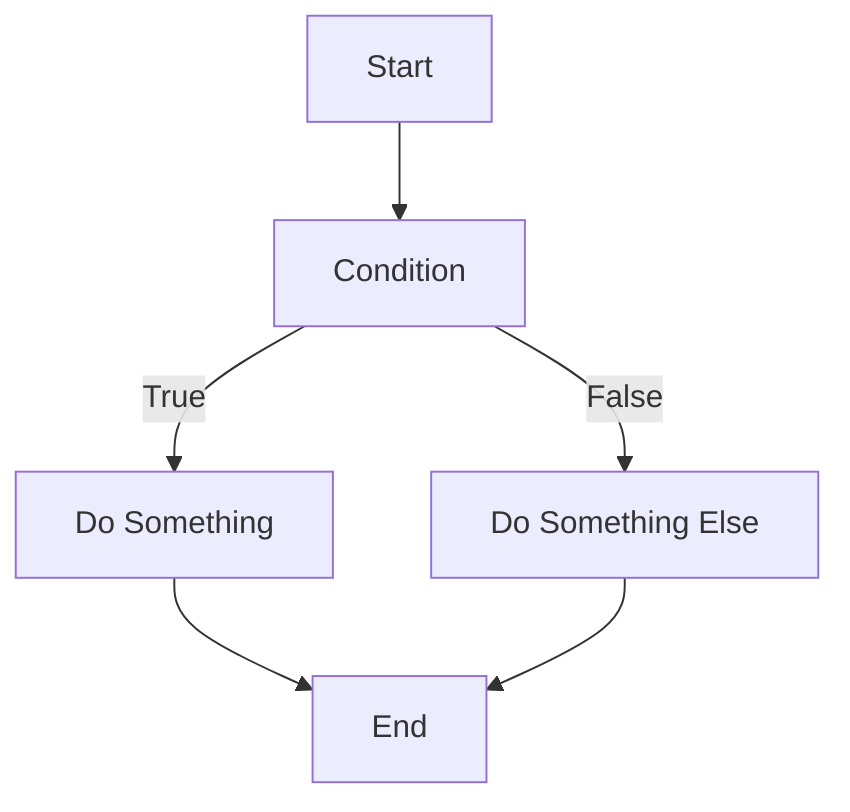

<show-structure for="chapter,procedure" depth="1"/>

[//]: # (<show-structure for="chapter,procedure" depth="2"/>)

# Conditionals


## Overview

### Definition

<table>
<tr>
<td>
<note>Conditional statements are essential programming constructs that allow us to make decisions based on certain conditions. These statements evaluate an expression and execute specific code blocks based on whether the condition is true or false. The most common conditional statements are `if`, `else if`, `else`, nested `if`, and `switch`.</note>
</td>
<td>



</td>
</tr>
</table>


### Use Cases

<table style="none">
<tr>
<td>

Decision-making
: Executing different code based on specific conditions.

</td>
<td>

Input Validation
: Checking user input for validity before processing it.

</td>
<td>

Flow Control
: Controlling program flow based on conditions.

</td>
</tr>
<tr>
<td>

Error Handling
: Handling specific error conditions.

</td>
<td>


</td>
<td>

Menu Selection
: Implementing menu-driven applications.

</td>
</tr>

</table>


### Pros & Cons

<table>
<tr>
<th>✅</th>
<th>❌</th>
</tr>
<tr>
<td>
<deflist collapsible="true">
    <def title="Improved Control" collapsible="true" default-state="collapsed">
        Allows the program to make dynamic decisions during runtime.
    </def>
    <def title="Readable Code" collapsible="true" default-state="collapsed">
        Conditional statements enhance code readability by expressing intent clearly.
    </def>
    <def title="Saves Resources" collapsible="true" default-state="collapsed">
        Prevents unnecessary execution of code, optimizing resource utilization.
    </def>
</deflist>
</td>
<td>
<deflist collapsible="true">
    <def title="Complexity" collapsible="true" default-state="collapsed">
        Multiple nested conditions can make code harder to maintain and understand.
    </def>
    <def title="Code Duplication" collapsible="true" default-state="collapsed">
        Repeating code blocks for similar conditions can lead to code duplication.
    </def>
    <def title="Potential Bugs" collapsible="true" default-state="collapsed">
        Incorrect conditions or missing cases can introduce bugs.
    </def>
</deflist>
</td>
</tr>
</table>


## If-else Statement

### Pseudocode If-else  {switcher-key="Pseudocode"}

<video src="https://youtu.be/osuzDDlBmRI?feature=shared" preview-src="if-else-statement-syntax.png" width="900"/>

Sample code

```text
if some condition is met, do something
if not met, do something else
```

### C++ If-else  {switcher-key="C++"}

<video src="https://youtu.be/TOx3tPJircc?feature=shared" preview-src="if-else-statement-syntax.png" width="900"/>

Sample code

``` c++
#include <iostream>
using namespace std;

int main() {
    int exam_score;
    int passing_threshold = 60;

    cout << "Enter your exam score: ";
    cin >> exam_score;

    if (exam_score >= passing_threshold) {
        cout << "Congratulations! You passed the exam." << endl;
    } else {
        cout << "Unfortunately, you did not pass the exam. Please try again." << endl;
    }

    return 0;
}
```

### Python If-else  {switcher-key="Python"}

<video src="https://youtu.be/NkVSSMt-h3Y?feature=shared" preview-src="if-else-statement-syntax.png" width="900"/>

Sample code

``` python
passing_threshold = 60

exam_score = int(input("Enter your exam score: "))

if exam_score >= passing_threshold:
    print("Congratulations! You passed the exam.")
else:
    print("Unfortunately, you did not pass the exam. Please try again.")
```

### Java If-else  {switcher-key="Java"}

<video src="https://youtu.be/P6ivQ3QRq0I?feature=shared" preview-src="if-else-statement-syntax.png" width="900"/>

Sample code

``` java
import java.util.Scanner;

public class Main {
    public static void main(String[] args) {
        Scanner scanner = new Scanner(System.in);
        int passing_threshold = 60;

        System.out.print("Enter your exam score: ");
        int exam_score = scanner.nextInt();

        if (exam_score >= passing_threshold) {
            System.out.println("Congratulations! You passed the exam.");
        } else {
            System.out.println("Unfortunately, you did not pass the exam. Please try again.");
        }
    }
}
```

### Golang If-else  {switcher-key="Golang"}

<video src="https://youtu.be/Hjqjff490B8?feature=shared" preview-src="if-else-statement-syntax.png" width="900"/>

Sample code

``` go
package main

import (
    "fmt"
)

func main() {
    var passing_threshold int = 60
    var exam_score int

    fmt.Print("Enter your exam score: ")
    fmt.Scan(&exam_score)

    if exam_score >= passing_threshold {
        fmt.Println("Congratulations! You passed the exam.")
    } else {
        fmt.Println("Unfortunately, you did not pass the exam. Please try again.")
    }
}
```

[//]: # (### Rust If-else  {switcher-key="Rust"})

[//]: # ()
[//]: # (<video src="https://youtu.be/MOa7ulhNYc0?feature=shared" preview-src="if-else-statement-syntax.png" width="900"/>)

[//]: # ()
[//]: # (Sample code)

[//]: # ()
[//]: # (``` rust)

[//]: # (use std::io;)

[//]: # ()
[//]: # (fn main&#40;&#41; {)

[//]: # (    let passing_threshold = 60;)

[//]: # ()
[//]: # (    println!&#40;"Enter your exam score: "&#41;;)

[//]: # (    let mut input = String::new&#40;&#41;;)

[//]: # (    io::stdin&#40;&#41;.read_line&#40;&mut input&#41;.expect&#40;"Failed to read line"&#41;;)

[//]: # (    let exam_score: i32 = input.trim&#40;&#41;.parse&#40;&#41;.expect&#40;"Please enter a valid number"&#41;;)

[//]: # ()
[//]: # (    if exam_score >= passing_threshold {)

[//]: # (        println!&#40;"Congratulations! You passed the exam."&#41;;)

[//]: # (    } else {)

[//]: # (        println!&#40;"Unfortunately, you did not pass the exam. Please try again."&#41;;)

[//]: # (    })

[//]: # (})

[//]: # (```)

### Output : Sample Output

<deflist collapsible="true" default-state="collapsed">
<def title="All Languages">

We prompt the user to enter their exam score and compare it with the `passing_threshold` value of `60`. If the `exam_score` is greater than or equal to `60`, the program outputs a success message indicating that the student passed the exam. Otherwise, it prints a message stating that the student did not pass and should try again.

Assume the user enters `75` as input for all the examples.

Since the input `75` is greater than the passing threshold of `60`, the output is:

<br/>

``` bash
Congratulations! You passed the exam.
```

</def>
</deflist>


## Switch / Match Statement

### Pseudocode Switch / Match {switcher-key="Pseudocode"}

<video src="https://youtu.be/osuzDDlBmRI?feature=shared" preview-src="switch-statement-syntax.png" width="900"/>

```text
condition to be met
    case (validation condition 1)
        // do something
    case (validation condition 2)
        // do something
    case (validation condition ...)
        // do something
    default
        // do this when no other conditions are met
```

### C++ Switch {switcher-key="C++"}

<video src="https://youtu.be/TOx3tPJircc?feature=shared" preview-src="switch-statement-syntax.png" width="900"/>

``` c++
#include <iostream>
using namespace std;

int main() {
    int day_number;

    cout << "Enter a day number (1 to 7): ";
    cin >> day_number;

    switch (day_number) {
        case 1:
            cout << "Sunday" << endl;
            break;
        case 2:
            cout << "Monday" << endl;
            break;
        case 3:
            cout << "Tuesday" << endl;
            break;
        case 4:
            cout << "Wednesday" << endl;
            break;
        case 5:
            cout << "Thursday" << endl;
            break;
        case 6:
            cout << "Friday" << endl;
            break;
        case 7:
            cout << "Saturday" << endl;
            break;
        default:
            cout << "Invalid day number. Please enter a number between 1 and 7." << endl;
            break;
    }

    return 0;
}
```

### Python Match {switcher-key="Python"}

<video src="https://youtu.be/NkVSSMt-h3Y?feature=shared" preview-src="switch-statement-syntax.png" width="900"/>

[//]: # (``` python)

[//]: # ()
[//]: # (```)

### Java Switch {switcher-key="Java"}

<video src="https://youtu.be/P6ivQ3QRq0I?feature=shared" preview-src="switch-statement-syntax.png" width="900"/>

``` java
import java.util.Scanner;

public class Main {
    public static void main(String[] args) {
        Scanner scanner = new Scanner(System.in);
        int day_number;

        System.out.print("Enter a day number (1 to 7): ");
        day_number = scanner.nextInt();

        switch (day_number) {
            case 1:
                System.out.println("Sunday");
                break;
            case 2:
                System.out.println("Monday");
                break;
            case 3:
                System.out.println("Tuesday");
                break;
            case 4:
                System.out.println("Wednesday");
                break;
            case 5:
                System.out.println("Thursday");
                break;
            case 6:
                System.out.println("Friday");
                break;
            case 7:
                System.out.println("Saturday");
                break;
            default:
                System.out.println("Invalid day number. Please enter a number between 1 and 7.");
                break;
        }
    }
}
```

### Golang Switch {switcher-key="Golang"}

<video src="https://youtu.be/Hjqjff490B8?feature=shared" preview-src="switch-statement-syntax.png" width="900"/>

``` go
package main

import (
    "fmt"
)

func main() {
    var day_number int

    fmt.Print("Enter a day number (1 to 7): ")
    fmt.Scan(&day_number)

    switch day_number {
    case 1:
        fmt.Println("Sunday")
    case 2:
        fmt.Println("Monday")
    case 3:
        fmt.Println("Tuesday")
    case 4:
        fmt.Println("Wednesday")
    case 5:
        fmt.Println("Thursday")
    case 6:
        fmt.Println("Friday")
    case 7:
        fmt.Println("Saturday")
    default:
        fmt.Println("Invalid day number. Please enter a number between 1 and 7.")
    }
}
```

//]: # (### Rust Match {switcher-key="Rust"})

[//]: # ()
[//]: # (<video src="https://youtu.be/MOa7ulhNYc0?feature=shared" preview-src="switch-statement-syntax.png" width="900"/>)

[//]: # ()
[//]: # (``` rust)

[//]: # (use std::io;)

[//]: # ()
[//]: # (fn main&#40;&#41; {)

[//]: # (    let mut day_number = String::new&#40;&#41;;)

[//]: # ()
[//]: # (    println!&#40;"Enter a day number &#40;1 to 7&#41;: "&#41;;)

[//]: # (    io::stdin&#40;&#41;.read_line&#40;&mut day_number&#41;.expect&#40;"Failed to read line"&#41;;)

[//]: # (    let day_number: i32 = day_number.trim&#40;&#41;.parse&#40;&#41;.expect&#40;"Please enter a valid number"&#41;;)

[//]: # ()
[//]: # (    match day_number {)

[//]: # (        1 => println!&#40;"Sunday"&#41;,)

[//]: # (        2 => println!&#40;"Monday"&#41;,)

[//]: # (        3 => println!&#40;"Tuesday"&#41;,)

[//]: # (        4 => println!&#40;"Wednesday"&#41;,)

[//]: # (        5 => println!&#40;"Thursday"&#41;,)

[//]: # (        6 => println!&#40;"Friday"&#41;,)

[//]: # (        7 => println!&#40;"Saturday"&#41;,)

[//]: # (        _ => println!&#40;"Invalid day number. Please enter a number between 1 and 7."&#41;,)

[//]: # (    })

[//]: # (})

[//]: # (```)

### Switch / Match : Sample Output

<deflist collapsible="true" default-state="collapsed">
<def title="All Languages">

We take a user input for the day_number and use a switch statement (or if-elif statements in Python) to display the 
corresponding day of the week. Assuming the user input is `3`, the output for each program is:

<br/>

``` bash
Tuesday
```
</def>
</deflist>
