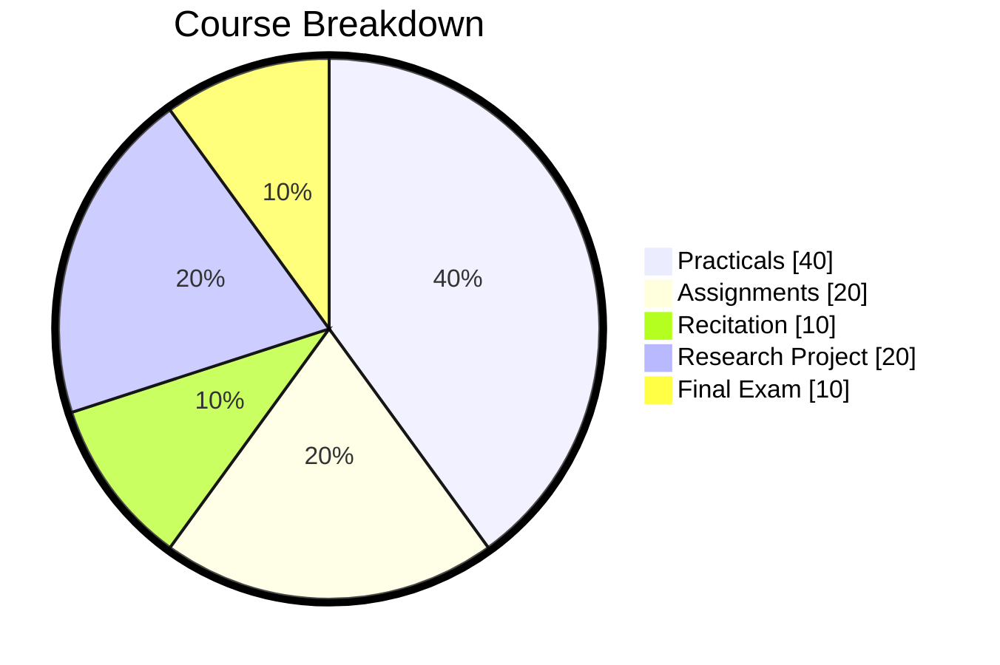

<show-structure for="chapter,procedure" depth="0"/>

# Introductions

<procedure switcher-key="CSC 200 EE">
<b>CSC 200 EE</b>

</procedure>

<procedure switcher-key="CSC 200 ME">
<b>CSC 200 ME</b>

</procedure>

## CSC 212 : Data Structures & Algorithms { switcher-key="CSC 212" }

<table>
<tr>
<td>

</td>
<td>

</td>
</tr>
</table>

<procedure>
<b></b>

<tabs>
<tab title="Data Structures Explained">
    <video src="https://youtu.be/SFEROgwxicA" width="900"></video>
</tab>
<tab title="Algorithms Explained">
    <video src="https://youtu.be/JJkWemM03Lg" width="900"></video>
</tab>
</tabs>

<note>

Data structures and algorithms are fundamental concepts in computer science that deal with the organization and manipulation of data.

A data structure is a way of storing and organizing data in a computer program so that it can be accessed and used efficiently. Some common data structures include arrays, linked lists, stacks, queues, trees, and graphs.

An algorithm is a set of instructions or procedures that a computer follows to solve a problem or perform a task. Algorithms are used to manipulate data in various ways, such as searching for specific information, sorting data, or performing mathematical operations.

Together, data structures and algorithms are essential tools for designing efficient and effective computer programs. By understanding how to choose the right data structure and algorithm for a specific task, developers can optimize the performance of their programs and improve their ability to handle large amounts of data.

</note>

</procedure>
