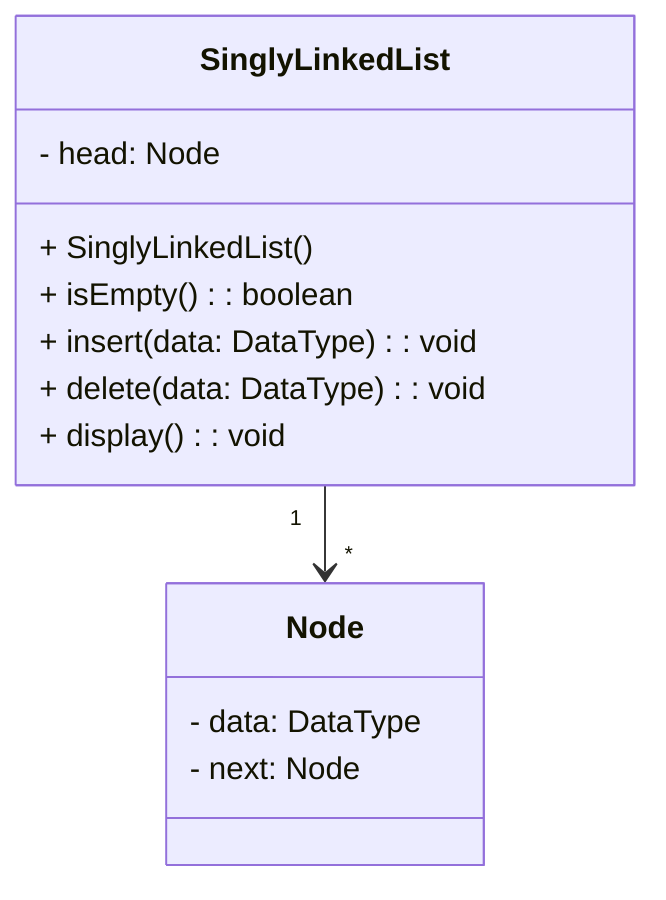
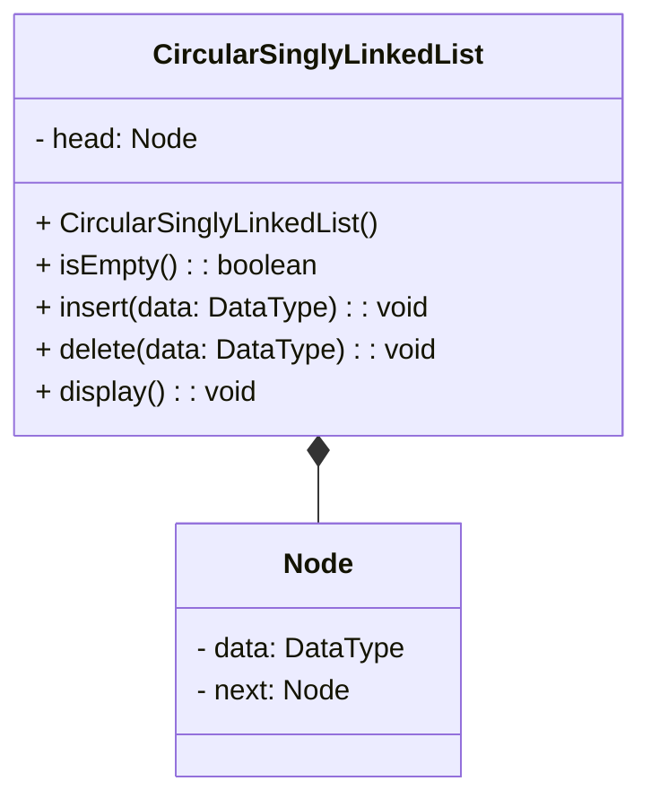
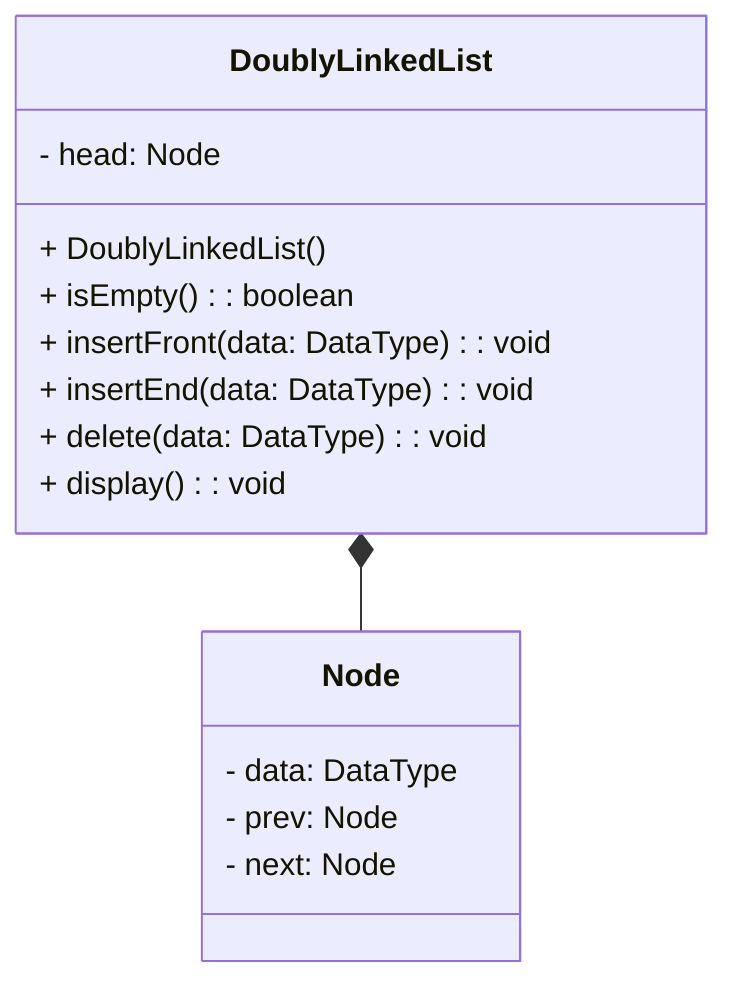
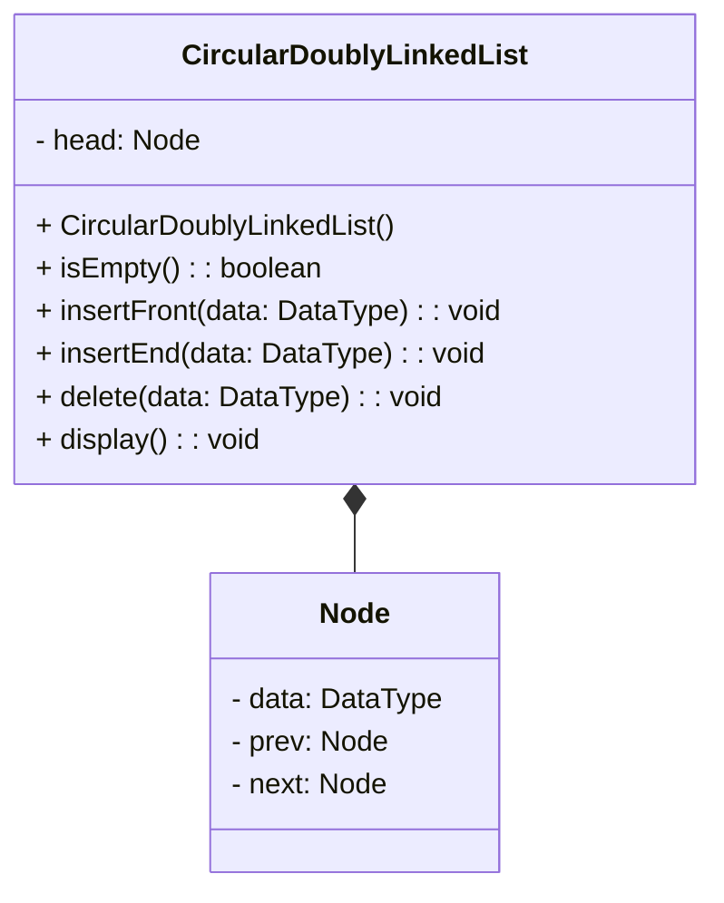

# Linked List

<video src="https://youtu.be/F8AbOfQwl1c?feature=shared" preview-src="redirection-rules.png" width="900"/>

## Overview

<procedure title="Background : How are lists implemented in CPython" collapsible="true" default-state="collapsed">

🐍 Time Sample

```Python
import time

n =- 100000

start  = time.time()
array = []
for i in range(n):
  array.append('s')
print(time.time() - start)

start  = time.time()
array = []
for i in range(n):
  array = array + ['s']
print(time.time() - start)
```


CPython’s lists are really variable-length arrays, not Lisp-style linked lists. The implementation uses a contiguous array of references to other objects, and keeps a pointer to this array and the array’s length in a list head structure.

This makes indexing a list <code>a[i]</code> an operation whose cost is independent of the size of the list or the value of the index.  

When items are appended or inserted, the array of references is resized. Some cleverness is applied to improve the performance of appending items repeatedly; when the array must be grown, some extra space is allocated so the next few times don’t require an actual resize.

CPython is the reference implementation of the Python programming language.

</procedure>


<procedure>
<b>Some STL Containers</b>
<step>Maintain the specified order of inserted elements.</step>

</procedure>


### Static Arrays

<procedure>
<b>Think about making insertions and deletions efficiently…</b>
<deflist collapsible="true" default-state="collapsed">
<def title="What is the computational cost of inserting or deleting 1 element?">
<procedure>

In C++, arrays are fixed-size data structures, which means that the size of the array is determined at the time of declaration and cannot be changed afterwards. Therefore, inserting or deleting elements in an array requires shifting the existing elements to create or close gaps.

Here are the computational costs of inserting and deleting from the rear, front, and at an index of an array:


- Inserting or deleting from the rear of an array takes constant time O(1)
    - only requires updating the index of the last element in the array.
- Inserting or deleting from the front of an array takes linear time O(n) where n is the number of elements in the array
    - requires shifting all existing elements by one position to make room for the new element or to close the gap left by the deleted element.
- Inserting or deleting at an arbitrary index of an array takes linear time O(n), where n is the number of elements in the array
    - requires shifting all elements from the insertion or deletion index to the end of the array by one position to create or close gaps.

Note that in addition to the computational costs, inserting or deleting from an array also incurs memory costs, as the size of the array may need to be adjusted to accommodate the new or deleted elements. Also, if the array is dynamically allocated, memory allocation and de-allocation costs may apply.
</procedure>
</def>
</deflist>

- rear ??
- front ??
- index ??


</procedure>


## Definition

<table style="none">
<tr>
<td rowspan="2">

[//]: # (FIXME : ADD UML DIAGRAMS BACK IN)

[//]: # (```plantuml)

[//]: # ()
[//]: # ()
[//]: # (@startuml)

[//]: # ()
[//]: # ()
[//]: # (class LinkedList {)

[//]: # ()
[//]: # (  - Node)

[//]: # ()
[//]: # (  - head: Node*)

[//]: # ()
[//]: # (  - size: size_t)

[//]: # ()
[//]: # (  + LinkedList&#40;&#41;)

[//]: # ()
[//]: # (  + ~LinkedList&#40;&#41;)

[//]: # ()
[//]: # (  + LinkedList&#40;const LinkedList& other&#41;)

[//]: # ()
[//]: # (  + operator=&#40;const LinkedList& other&#41;)

[//]: # ()
[//]: # (  + void pushFront&#40;const T& element&#41;)

[//]: # ()
[//]: # (  + void popFront&#40;&#41;)

[//]: # ()
[//]: # (  + void pushBack&#40;const T& element&#41;)

[//]: # ()
[//]: # (  + void popBack&#40;&#41;)

[//]: # ()
[//]: # (  + T& operator[]&#40;size_t index&#41; const)

[//]: # ()
[//]: # (  + size_t getSize&#40;&#41; const)

[//]: # ()
[//]: # (})

[//]: # ()
[//]: # ()
[//]: # (class Node {)

[//]: # ()
[//]: # (  - data: T)

[//]: # ()
[//]: # (  - next: Node*)

[//]: # ()
[//]: # (  + Node&#40;const T& data&#41;)

[//]: # ()
[//]: # (})

[//]: # ()
[//]: # ()
[//]: # (LinkedList *-- Node)

[//]: # ()
[//]: # ()
[//]: # (@enduml)

[//]: # ()
[//]: # ()
[//]: # ()
[//]: # (```)



</td>
<td>
<b>LinkedList</b>
<deflist collapsible="true" default-state="collapsed">
<def title="Key Elements">
    <deflist>
    <def title="head">Points to the first node.</def>
    <def title="size">Holds the number of nodes.</def>
    </deflist>
</def>
<def title="Public Methods">
    <deflist>
    <def title="LinkedList()"> Default constructor.</def>
    <def title="~LinkedList()"> Destructor.</def>
    <def title="LinkedList(const LinkedList&amp; other)"> Copy constructor.</def>
    <def title="operator=(const LinkedList&amp; other)"> Assignment operator.</def>
    <def title="pushFront(const T&amp; element)"> Adds an element to the front of the list.</def>
    <def title="popFront()"> Removes the first element.</def>
    <def title="pushBack(const T&amp; element)"> Adds an element to the end of the list.</def>
    <def title="popBack()"> Removes the last element.</def>
    <def title="operator[](size_t index) const"> Overloaded subscript operator for element access.</def>
    <def title="getSize() const"> Returns the current size of the list.</def>
    </deflist>
</def>
</deflist>

</td>
</tr>
<tr>
<td>
<b>Node</b>
<deflist collapsible="true" default-state="collapsed">
<def title="Key Elements" >
    <deflist>
    <def title="data">Holds the actual data.</def>
    <def title="next">Points to the next node.</def>
    </deflist>
</def>
<def title="Public Methods">
    <deflist>
    <def title="Node(const T&amp; data)">Constructor for creating a node with given data.</def>
    </deflist>
</def>
</deflist>
</td>
</tr>
<tr>
<td>

```c++
class LinkedList
{
  private:
    Node *head;
    // private data/methods
    // ...

  public:
    List();
    ~List();
    // public methods
    // ...
    // ...
};
```

</td>
<td>

```c++
class Node
{
    private:
        int data;
        Node *next;
        // private data/methods
        // ...

    public:
        Node (int d);
        ~Node();

        Friend class List;
};
```

</td>
</tr>
</table>

<deflist>
<def title="Simplified Definition">
Collections of sequential elements stored at <format color="Red">non-contiguous</format> locations in memory

Elements are stored in <format color="LimeGreen">node</format>

Nodes are connected by <format color="LimeGreen">links</format>
- every node keeps a pointer to the next node

Can grow and shrink dynamically

Allow for fast insertions/deletions
</def>
</deflist>


### Singly Linked List

<procedure>

```mermaid

flowchart LR
    data=7-->| x5638 | data=10
    data=10-->| x3800 | data=15
    data=15-->| x8800 | data=20
    data=20-->| x0100 | nullptr

```

- Each node will hold some bit of data and a pointer to the next node in the list.
- The last node in the list will have a pointer to null.

</procedure>

<procedure>
<b>Implementing a Linked List</b>
<p>Requires an understanding of :</p>

<code-block lang="tex"> \text{C++ Classes}</code-block>
- <code-block lang="tex"> \text{dot notation} \ \ \ ( . ) </code-block>
- <code-block lang="tex"> \text{arrow notation} \ \ \ ( \rightarrow ) </code-block>

<code-block lang="tex"> \text{Pointers}</code-block>
- <code-block lang="c++"> nullptr</code-block>
- <code-block lang="tex"> \text{dynamic memory allocation}</code-block>

<code-block lang="tex"> \text{Dynamic Memory Allocation}</code-block>
- <code-block lang="c++"> new</code-block>
- <code-block lang="c++"> delete</code-block>

</procedure>

<procedure>
<tabs>
<tab title="Insert@Tail">
<procedure>


```text
method insertAtTail(data):
    newNode = Node(data)
    if head is null:
        head = newNode
        tail = newNode
    else:
        tail.next = newNode
        tail = newNode
    size = size + 1
```

</procedure>
</tab>
<tab title="Insert@Head">
<procedure>


```text
method insertAtHead(data):
    newNode = Node(data)
    if head is null:
        head = newNode
        tail = newNode
    else:
        newNode.next = head
        head = newNode
    size = size + 1
```

</procedure>
</tab>
<tab title="Insert@Nth">
<procedure>


```text
method insertAtNth(data, position):
    newNode = Node(data)
    if position is 0:
        newNode.next = head
        head = newNode
    else:
        current = head
        for i in 0 to position-1:
            current = current.next
        newNode.next = current.next
        current.next = newNode
    size = size + 1
```

</procedure>
</tab>
<tab title="Delete@Tail">
<procedure>


```text
method deleteAtTail():
    if head is null:
        return
    if head is tail:
        head = null
        tail = null
    else:
        current = head
        while current.next is not tail:
            current = current.next
        current.next = null
        tail = current
    size = size - 1
```

</procedure>
</tab>
<tab title="Delete@Head">
<procedure>


```text
method removeFromFront():
    if head is null:
        return "List is empty"
    else if head = tail:
        head = null
        tail = null
    else:
        head = head.next
    size = size - 1
```

</procedure>
</tab>
<tab title="Delete@Nth">
<procedure>


```text
method deleteAtNth(position):
    if head is null:
        return "List is empty"
    else if position is 0:
        head = head.next
    else:
        current = head
        for i in 0 to position-1:
            current = current.next
        current.next = current.next.next
    size = size - 1
```

</procedure>
</tab>
<tab title="Search">
<procedure>

```text
method search(data):
    current = head
    while current is not null:
        if current.data is data:
            return "Found"
        current = current.next
    return "Not Found"
```

</procedure>
</tab>
<tab title="Print">
<procedure>

```text
method print():
    current = head
    while current is not null:
        print current.data
        current = current.next
```

</procedure>
</tab>
</tabs>
</procedure>

### Variations

<procedure>
<tabs>
<tab title="Visualize">

</tab>
<tab title="Circular Linked List">


<br/>



<br/>

```c++
// Define a Node class to represent each node in the circular singly-linked list
class Node {
public:
    T data; // data stored in the node
    Node* next; // pointer to the next node in the list

    // constructor to initialize a new node with the given data and next pointer
    Node(T data, Node* next = nullptr) {
        this->data = data;
        this->next = next;
    }
};

// Define the CircularSinglyLinkedList class to represent the circular singly-linked list 
class CircularSinglyLinkedList {
private:
    Node* tail; // pointer to the last node in the list
    
public:
    // constructor to initialize an empty list with a null tail pointer
    CircularSinglyLinkedList() {
        tail = nullptr;
    }
};
```

</tab>
<tab title="Doubly Linked List">


<br/>



<br/>

```c++
// Node of a doubly linked list
class Node {
public:
    int data;

    // Pointer to next node in DLL
    Node* next;

    // Pointer to previous node in DLL
    Node* prev;
};
```


[//]: # (FIXME : ADD UML DIAGRAMS BACK IN)

[//]: # (```plantuml)

[//]: # ()
[//]: # ()
[//]: # (@startuml)

[//]: # ()
[//]: # (class Node {)

[//]: # ()
[//]: # (  - data: DataType)

[//]: # ()
[//]: # (  - prev: Node)

[//]: # ()
[//]: # (  - next: Node)

[//]: # ()
[//]: # (})

[//]: # ()
[//]: # (class DoublyLinkedList {)

[//]: # ()
[//]: # (  - head: Node)

[//]: # ()
[//]: # (  + DoublyLinkedList&#40;&#41;)

[//]: # ()
[//]: # (  + isEmpty&#40;&#41;: boolean)

[//]: # ()
[//]: # (  + insertFront&#40;data: DataType&#41;: void)

[//]: # ()
[//]: # (  + insertEnd&#40;data: DataType&#41;: void)

[//]: # ()
[//]: # (  + delete&#40;data: DataType&#41;: void)

[//]: # ()
[//]: # (  + display&#40;&#41;: void)

[//]: # ()
[//]: # (})

[//]: # ()
[//]: # ()
[//]: # (DoublyLinkedList *-- Node)

[//]: # ()
[//]: # ()
[//]: # (@enduml)

[//]: # ()
[//]: # (```)

</tab>
<tab title="Circular Doubly Linked List">


<br/>



<br/>

```c++
// Node of a doubly linked list
class Node {
public:
    int data;

    // Pointer to next node in DLL
    Node* next;

    // Pointer to previous node in DLL
    Node* prev;
};
```

</tab>
</tabs>
</procedure>


