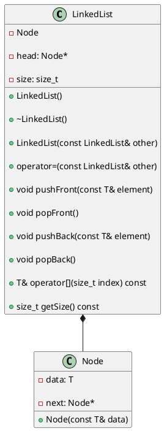
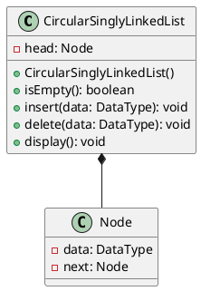
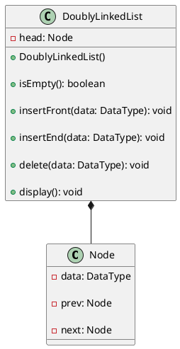

# Linked List

<video src="https://youtu.be/F8AbOfQwl1c?feature=shared" preview-src="redirection-rules.png" width="900"/>

## Overview

<procedure title="Background : How are lists implemented in CPython" collapsible="true" default-state="collapsed">

🐍 Time Sample

```Python
import time

n =- 100000

start  = time.time()
array = []
for i in range(n):
  array.append('s')
print(time.time() - start)

start  = time.time()
array = []
for i in range(n):
  array = array + ['s']
print(time.time() - start)
```


CPython’s lists are really variable-length arrays, not Lisp-style linked lists. The implementation uses a contiguous array of references to other objects, and keeps a pointer to this array and the array’s length in a list head structure.

This makes indexing a list <code>a[i]</code> an operation whose cost is independent of the size of the list or the value of the index.  

When items are appended or inserted, the array of references is resized. Some cleverness is applied to improve the performance of appending items repeatedly; when the array must be grown, some extra space is allocated so the next few times don’t require an actual resize.

CPython is the reference implementation of the Python programming language.

</procedure>


<procedure>
<b>Some STL Containers</b>
<step>Maintain the specified order of inserted elements.</step>

</procedure>


### Static Arrays

<procedure>
<b>Think about making insertions and deletions efficiently…</b>
<deflist collapsible="true" default-state="collapsed">
<def title="What is the computational cost of inserting or deleting 1 element?">
<procedure>

In C++, arrays are fixed-size data structures, which means that the size of the array is determined at the time of declaration and cannot be changed afterwards. Therefore, inserting or deleting elements in an array requires shifting the existing elements to create or close gaps.

Here are the computational costs of inserting and deleting from the rear, front, and at an index of an array:


- Inserting or deleting from the rear of an array takes constant time O(1)
    - only requires updating the index of the last element in the array.
- Inserting or deleting from the front of an array takes linear time O(n) where n is the number of elements in the array
    - requires shifting all existing elements by one position to make room for the new element or to close the gap left by the deleted element.
- Inserting or deleting at an arbitrary index of an array takes linear time O(n), where n is the number of elements in the array
    - requires shifting all elements from the insertion or deletion index to the end of the array by one position to create or close gaps.

Note that in addition to the computational costs, inserting or deleting from an array also incurs memory costs, as the size of the array may need to be adjusted to accommodate the new or deleted elements. Also, if the array is dynamically allocated, memory allocation and de-allocation costs may apply.
</procedure>
</def>
</deflist>

- rear ??
- front ??
- index ??


</procedure>


## Definition

<table style="none">
<tr>
<td rowspan="2">

[//]: # (FIXME : ADD UML DIAGRAMS BACK IN)



</td>
<td>
<b>LinkedList</b>
<deflist collapsible="true" default-state="collapsed">
<def title="Key Elements">
    <deflist>
    <def title="head">Points to the first node.</def>
    <def title="size">Holds the number of nodes.</def>
    </deflist>
</def>
<def title="Public Methods">
    <deflist>
    <def title="LinkedList()"> Default constructor.</def>
    <def title="~LinkedList()"> Destructor.</def>
    <def title="LinkedList(const LinkedList&amp; other)"> Copy constructor.</def>
    <def title="operator=(const LinkedList&amp; other)"> Assignment operator.</def>
    <def title="pushFront(const T&amp; element)"> Adds an element to the front of the list.</def>
    <def title="popFront()"> Removes the first element.</def>
    <def title="pushBack(const T&amp; element)"> Adds an element to the end of the list.</def>
    <def title="popBack()"> Removes the last element.</def>
    <def title="operator[](size_t index) const"> Overloaded subscript operator for element access.</def>
    <def title="getSize() const"> Returns the current size of the list.</def>
    </deflist>
</def>
</deflist>

</td>
</tr>
<tr>
<td>
<b>Node</b>
<deflist collapsible="true" default-state="collapsed">
<def title="Key Elements" >
    <deflist>
    <def title="data">Holds the actual data.</def>
    <def title="next">Points to the next node.</def>
    </deflist>
</def>
<def title="Public Methods">
    <deflist>
    <def title="Node(const T&amp; data)">Constructor for creating a node with given data.</def>
    </deflist>
</def>
</deflist>
</td>
</tr>
<tr>
<td>

```c++
class LinkedList
{
  private:
    Node *head;
    // private data/methods
    // ...

  public:
    List();
    ~List();
    // public methods
    // ...
    // ...
};
```

</td>
<td>

```c++
class Node
{
    private:
        int data;
        Node *next;
        // private data/methods
        // ...

    public:
        Node (int d);
        ~Node();

        Friend class List;
};
```

</td>
</tr>
</table>

<deflist>
<def title="Simplified Definition">
Collections of sequential elements stored at <format color="Red">non-contiguous</format> locations in memory

Elements are stored in <format color="LimeGreen">node</format>

Nodes are connected by <format color="LimeGreen">links</format>
- every node keeps a pointer to the next node

Can grow and shrink dynamically

Allow for fast insertions/deletions
</def>
</deflist>


### Singly Linked List

<procedure>

```mermaid

flowchart LR
    data=7-->| x5638 | data=10
    data=10-->| x3800 | data=15
    data=15-->| x8800 | data=20
    data=20-->| x0100 | nullptr

```

- Each node will hold some bit of data and a pointer to the next node in the list.
- The last node in the list will have a pointer to null.

</procedure>

<procedure>
<b>Implementing a Linked List</b>
<p>Requires an understanding of :</p>

<code-block lang="tex"> \text{C++ Classes}</code-block>
- <code-block lang="tex"> \text{dot notation} \ \ \ ( . ) </code-block>
- <code-block lang="tex"> \text{arrow notation} \ \ \ ( \rightarrow ) </code-block>

<code-block lang="tex"> \text{Pointers}</code-block>
- <code-block lang="c++"> nullptr</code-block>
- <code-block lang="tex"> \text{dynamic memory allocation}</code-block>

<code-block lang="tex"> \text{Dynamic Memory Allocation}</code-block>
- <code-block lang="c++"> new</code-block>
- <code-block lang="c++"> delete</code-block>

</procedure>

<procedure>
<tabs>
<tab title="Insert@Head">
<procedure>


**Delete an element at the beginning in singly linked list**
- Create a new node
- Assign its data value
- Assign newly created node’s next ptr to current head reference. So, it points to the previous start node of the linked list address
- Change the head reference to the new node’s address.
</procedure>
</tab>
<tab title="Insert@Tail">
<procedure>


**Insert an element at the end in singly linked list**

- Create a new node
- Assign its data value
- Assign its next node to NULL as this will be the last(tail) node
- Check if the list is empty
- Change the head node to the new node
- If not then traverse till the last node
- Assign the last node’s next pointer to this new node
- Now, the new node has become the last node.
</procedure>
</tab>
<tab title="Insert@Nth">
<procedure>


**Insertion at nth position node**

- First we will create a new node named by newnode and put the position where u want to insert the node.
- Now give the address of the new node in previous node means link the new node with previous node.
- After this, give the address of current node in new node.Means link your new node also with current node.
</procedure>
</tab>
<tab title="Delete@Tail">
<procedure>


**Delete an element from end in singly linked list**

- Check if the Linked List is empty as we can not delete from an empty Linked List
- Check if the Linked List has only one Node
- In this case, just point the head to NULL and free memory for the existing node
- Otherwise, if the linked list has more than one node, traverse to the end of the Linked List
- Point next of 2nd Last node to NULL
- Free the memory for the last node.
</procedure>
</tab>
<tab title="Delete@Head">
<procedure>


**Delete an element from end in singly linked list**

- Traverse to element before the element to be deleted
- Change next pointers to exclude the node from the chain
</procedure>
</tab>
<tab title="Delete@Nth">
<procedure>


**Delete a Linked List node at a given position**

- Insert the initial items in the linked list
- Calculate the current size of the linked list
- Ask the user for nth position he wants to delete
  - `if(n < 1 || n > size)` then say invalid
- If deleting the first node, just change the head to the next item in Linked List
- Else traverse to the nth node to delete
- Change the next of (`n-1`)th node to (n+1)th node
- Free the memory for th nth node

</procedure>
</tab>
</tabs>
</procedure>

### Variations

<procedure>
<tabs>
<tab title="Visualize">

</tab>
<tab title="Circular Linked List">


<br/>

[//]: # (FIXME : ADD UML DIAGRAMS BACK IN)



<br/>

```c++

// Define a Node class to represent each node in the circular singly-linked list
class Node {
public:
    T data; // data stored in the node
    Node* next; // pointer to the next node in the list

    // constructor to initialize a new node with the given data and next pointer
    Node(T data, Node* next = nullptr) {
        this->data = data;
        this->next = next;
    }
};

// Define the CircularSinglyLinkedList class to represent the circular singly-linked list
class CircularSinglyLinkedList {
private:
    Node* tail; // pointer to the last node in the list

public:
    // constructor to initialize an empty list with a null tail pointer
    CircularSinglyLinkedList() {
        tail = nullptr;
    }
};
```

</tab>
<tab title="Doubly Linked List">


<br/>

[//]: # (FIXME : ADD UML DIAGRAMS BACK IN)



<br/>

```c++

// Node of a doubly linked list
class Node {
public:
    int data;

    // Pointer to next node in DLL
    Node* next;

    // Pointer to previous node in DLL
    Node* prev;
};
```

</tab>
</tabs>
</procedure>


