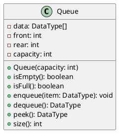

# Queue

<video src="https://youtu.be/D6gu-_tmEpQ?feature=shared" preview-src="queue1.jpeg" width="900"  />


## Overview

<note>

**What is a Queue?**

A queue is a data structure that stores items in a first-in, first-out (FIFO) order. In a FIFO data structure, the first item added to the queue will be the first item removed. This is equivalent to the requirement that once a new element is added, all elements that were added before have to be removed before the new element can be removed.
</note>

## Use Cases

<procedure>

Use cases for a queue include:

- Storing the order of operations in a calculator
- Storing the order of web pages visited in a web browser
- Storing the order of function calls in a program
- Storing the order of undo operations in a program
- Storing the order of transactions in a bank account
- Storing the order of processes in an operating system
- Storing the order of tasks in a thread pool
- Storing the order of messages in a message queue

</procedure>


## Implementation

<table style="none">
<tr>
<td>


</td>
<td>

<deflist collapsible="true" default-state="collapsed">
<def title="Key Elements" default-state="collapsed">
    <deflist>
        <def title="data">is an array to store the elements of the queue.</def>
        <def title="front">is an integer representing the index of the front element in the queue.</def>
        <def title="rear">is an integer representing the index of the rear element in the queue.</def>
        <def title="capacity">is the maximum number of elements the queue can hold.</def>
    </deflist>
</def>
<def title="Methods">
    <deflist>
        <def title="isEmpty()">returns true if the queue is empty, false otherwise.</def>
        <def title="isFull()">returns true if the queue is full, false otherwise.</def>
        <def title="enqueue(item)">adds an item to the rear of the queue.</def>
        <def title="dequeue()">removes an item from the front of the queue.</def>
        <def title="peek()">returns the item at the front of the queue without removing it.</def>
        <def title="size()">returns the number of items in the queue.</def>
    </deflist>
</def>
</deflist>
</td>
</tr>
<tr style="none">
<td colspan="2">

<tip>
<b>Enqueue</b>
<p>Enqueuing an item onto a queue is a simple operation. The item is added to the rear of the queue. This is done by adding the item to the rear of the queue and then incrementing the rear of the queue.</p>
</tip>

<tip>
<b>Dequeue</b>
<p>Dequeuing an item from a queue is a simple operation. The item is removed from the front of the queue. This is done by removing the item from the front of the queue and then incrementing the front of the queue.</p>
</tip>

<tip>
<b>Peek</b>
<p>Peeking at an item in a queue is a simple operation. The item is returned from the front of the queue. This is done by returning the item from the front of the queue.</p>
</tip>

</td>
</tr>
</table>

#### Sample Code

```c++
#include <cassert>
#include <iostream>
#include <queue>
 
int main()
{
    std::queue<int> q;
 
    q.push(0); // back pushes 0
    q.push(1); // q = 0 1
    q.push(2); // q = 0 1 2
    q.push(3); // q = 0 1 2 3
 
    assert(q.front() == 0);
    assert(q.back() == 3);
    assert(q.size() == 4);
 
    q.pop(); // removes the front element, 0
    assert(q.size() == 3);
 
    // Print and remove all elements. Note that std::queue does not
    // support begin()/end(), so a range-for-loop cannot be used.
    std::cout << "q: ";
    for (; !q.empty(); q.pop())
        std::cout << q.front() << ' ';
    std::cout << '\n';
    assert(q.size() == 0);
}
```

#### Output

```text
q: 1 2 3
```

### Considerations


