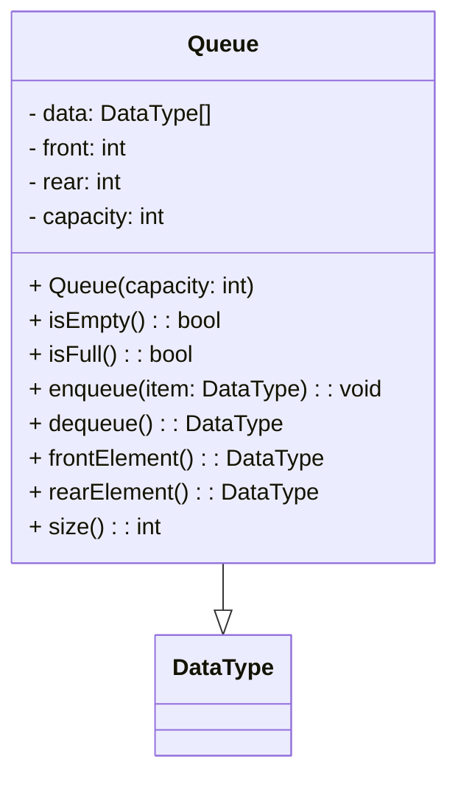

# Queue

<video src="https://youtu.be/D6gu-_tmEpQ?feature=shared" preview-src="queue1.jpeg" width="900"  />


## Overview

<note>

**What is a Queue?**

A queue is a data structure that stores items in a first-in, first-out (FIFO) order. In a FIFO data structure, the first item added to the queue will be the first item removed. This is equivalent to the requirement that once a new element is added, all elements that were added before have to be removed before the new element can be removed.
</note>

## Use Cases

<procedure>

Use cases for a queue include:

Storing the order of 

- operations in a calculator
- web pages visited in a web browser
- function calls in a program
- undo operations in a program
- transactions in a bank account
- processes in an operating system
- tasks in a thread pool
- messages in a message queue

</procedure>

<table>
<tr>
<td>Pros</td><td>Cons</td>
</tr>
<tr>
<td>

- easy to implement.
- easy to use.
- efficient.
- fast.
- simple.
- flexible.
- versatile.
- useful.
- powerful.
</td>
<td>

- not thread-safe.
- not synchronized.
- not concurrent.
- not atomic.
- not scalable.
- not distributed.
- not parallel.
- not asynchronous.
- not fault-tolerant.
- not distributed.
</td>
</tr>
</table>


## Implementation

<table style="none">
<tr>
<td colspan="2">

[//]: # (FIXME : ADD UML DIAGRAMS BACK IN)

[//]: # (<code-block lang="plantuml">)

[//]: # (    @startuml)

[//]: # (    class Queue {)

[//]: # (      - data: DataType[])

[//]: # (      - front: int)

[//]: # (      - rear: int)

[//]: # (      - capacity: int)

[//]: # (    ..)

[//]: # (      + Queue&#40;capacity: int&#41;)

[//]: # (        + isEmpty&#40;&#41;: boolean)

[//]: # (        + isFull&#40;&#41;: boolean)

[//]: # (        + enqueue&#40;item: DataType&#41;: void)

[//]: # (        + dequeue&#40;&#41;: DataType)

[//]: # (        + peek&#40;&#41;: DataType)

[//]: # (        + size&#40;&#41;: int)

[//]: # (    })

[//]: # (    @enduml)

[//]: # (</code-block>)



</td>
<td colspan="4">

<deflist collapsible="true" default-state="collapsed">
<def title="Key Elements" default-state="collapsed">
    <deflist>
        <def title="data">is an array to store the elements of the queue.</def>
        <def title="front">is an integer representing the index of the front element in the queue.</def>
        <def title="rear">is an integer representing the index of the rear element in the queue.</def>
        <def title="capacity">is the maximum number of elements the queue can hold.</def>
    </deflist>
</def>
<def title="Methods">
    <deflist>
        <def title="isEmpty()">returns true if the queue is empty, false otherwise.</def>
        <def title="isFull()">returns true if the queue is full, false otherwise.</def>
        <def title="enqueue(item)">adds an item to the rear of the queue.</def>
        <def title="dequeue()">removes an item from the front of the queue.</def>
        <def title="peek()">returns the item at the front of the queue without removing it.</def>
        <def title="size()">returns the number of items in the queue.</def>
    </deflist>
</def>
</deflist>
</td>
</tr>
<tr>
<td colspan="6">


{ center="true" thumbnail="true" }
</td>
</tr>
<tr>
<td colspan="2">
<tip>
<b>Enqueue</b>
<p>Enqueuing an item onto a queue is a simple operation. The item is added to the rear of the queue. This is done by adding the item to the rear of the queue and then incrementing the rear of the queue.</p>
</tip>
</td>
<td colspan="2">
<tip>
<b>Peek</b>
<p>Peeking at an item in a queue is a simple operation. The item is returned from the front of the queue. This is done by returning the item from the front of the queue.</p>
</tip>
</td>
<td colspan="2">
<tip>
<b>Dequeue</b>
<p>Dequeuing an item from a queue is a simple operation. The item is removed from the front of the queue. This is done by removing the item from the front of the queue and then incrementing the front of the queue.</p>
</tip>
</td>
</tr>
</table>

### Sample Code

<procedure>

```c++
#include <cassert>
#include <iostream>
#include <queue>
 
int main()
{
    std::queue<int> q;
 
    q.push(0); // back pushes 0
    q.push(1); // q = 0 1
    q.push(2); // q = 0 1 2
    q.push(3); // q = 0 1 2 3
 
    assert(q.front() == 0);
    assert(q.back() == 3);
    assert(q.size() == 4);
 
    q.pop(); // removes the front element, 0
    assert(q.size() == 3);
 
    // Print and remove all elements. Note that std::queue does not
    // support begin()/end(), so a range-for-loop cannot be used.
    std::cout << "q: ";
    for (; !q.empty(); q.pop())
        std::cout << q.front() << ' ';
    std::cout << '\n';
    assert(q.size() == 0);
}
```

<br/>

```text
// Output

q: 1 2 3
```
{ collapsible="true" }

</procedure>

## Building your own Queue

<procedure>

<tabs>
<tab title="Flowchart">

[//]: # (![Queue]&#40;https://cdn.programiz.com/sites/tutorial2program/files/simple-queue_0.png&#41;)


{ center="true" thumbnail="true" }
</tab>
<tab title="enqueue">

```text
1. Check if the queue is full.
2. If the queue is full, throw an error.
3. If the queue is not full, increment the rear of the queue.
4. Add the item to the rear of the queue.
```
</tab>
<tab title="dequeue">

```text
1. Check if the queue is empty.
2. If the queue is empty, throw an error.
3. If the queue is not empty, return the item at the front of the queue.
4. Increment the front of the queue.
```
</tab>
<tab title="isEmpty">

```text
1. Check if the front of the queue is equal to the rear of the queue.
2. If the front of the queue is equal to the rear of the queue, return true.
3. If the front of the queue is not equal to the rear of the queue, return false.
```
</tab>
<tab title="isFull">

```text
1. Check if the rear of the queue is equal to the capacity of the queue.
2. If the rear of the queue is equal to the capacity of the queue, return true.
3. If the rear of the queue is not equal to the capacity of the queue, return false.
```
</tab>
<tab title="frontElement">

```text
1. Check if the queue is empty.
2. If the queue is empty, throw an error.
3. If the queue is not empty, return the item at the front of the queue.
```
</tab>
<tab title="rearElement">

```text
1. Check if the queue is empty.
2. If the queue is empty, throw an error.
3. If the queue is not empty, return the item at the rear of the queue.
```
</tab>
<tab title="Size">

```text
1. Return the rear of the queue minus the front of the queue plus 1.
```

</tab>
</tabs>

</procedure>


### Considerations

<procedure>


<deflist collapsible="true">
<def title="Overflow">


{ center="true" thumbnail="true" }

error can be thrown when calling <code>enqueue</code> on a full queue (especially in fixed-length implementations)
</def>
<def title="Underflow">error can be thrown when calling <code>dequeue</code> on an empty queue</def>
</deflist>

</procedure>


### Time &amp; Space Complexity

```tex
\begin{array}{lclclclclcl}
\hline
\textbf{Operation} & \textbf{Worst Case} & \textbf{Avg Case} & \textbf{Best Case} \\
\hline
\text{Enqueue} & \mathcal{O}(1) & \mathcal{O}(1) & \mathcal{O}(1) \\
\hline
\text{Dequeue} & \mathcal{O}(1) & \mathcal{O}(1) & \mathcal{O}(1) \\
\hline
\text{Peek} & \mathcal{O}(1) & \mathcal{O}(1) & \mathcal{O}(1) \\
\hline
\text{Size} & \mathcal{O}(1) & \mathcal{O}(1) & \mathcal{O}(1) \\
\hline
\text{isEmpty} & \mathcal{O}(1) & \mathcal{O}(1) & \mathcal{O}(1) \\
\hline
\text{isFull} & \mathcal{O}(1) & \mathcal{O}(1) & \mathcal{O}(1) \\
\hline
\end{array}
```


