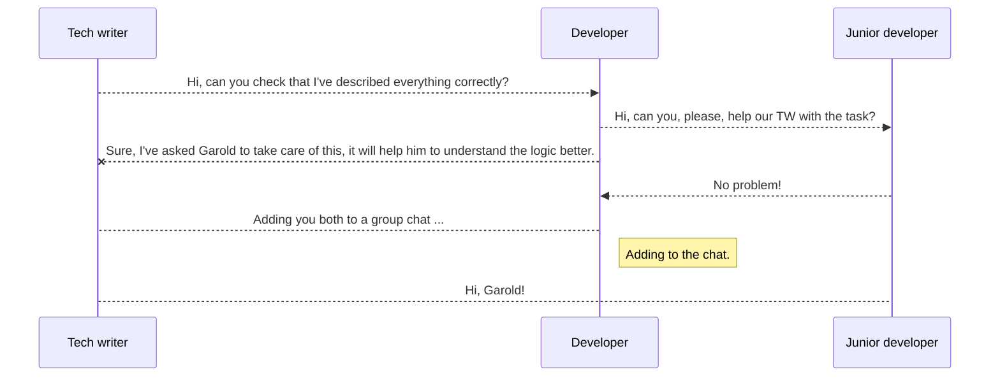

# Sequences

<video src="https://youtu.be/dYfgSLGV3mc?feature=shared" mini-player="false"/>

<note>

a function whose domain is the set of *positive* integers:

<code-block lang="tex">
\begin{align}
\{ 1, 2, 3, 4, \dots \}
\end{align}
</code-block>

</note>

<table>
<tr><td colspan="8">
The general, or <code-block lang="tex">\n^{th}</code-block> term, is denoted as <code-block 
lang="tex">\a_{n}
</code-block>
</td></tr>
<tr>
<td>odd integers</td>
<td>1</td>
<td>3</td>
<td>5</td>
<td>7</td>
<td>9</td>
<td><code-block lang="tex">\\dots</code-block></td>
<td><code-block lang="tex">\n</code-block></td>
</tr>
<tr>
<td>perfect squares</td>
<td>1</td>
<td>4</td>
<td>9</td>
<td>16</td>
<td>25</td>
<td><code-block lang="tex">\\dots</code-block></td>
<td><code-block lang="tex">\n</code-block></td>
</tr>
<tr>
<td></td>
<td><code-block lang="tex">\a_{1}</code-block></td>
<td><code-block lang="tex">\a_{2}</code-block></td>
<td><code-block lang="tex">\a_{3}</code-block></td>
<td><code-block lang="tex">\a_{4}</code-block></td>
<td><code-block lang="tex">\a_{5}</code-block></td>
<td><code-block lang="tex">\\dots</code-block></td>
<td><code-block lang="tex">\a_{n}</code-block></td>
</tr>
</table>

## Find the first five 

[//]: # (first five terms in sequence)
<table>
<tr><td colspan="2">
Write out the first five (5) terms of the sequence...
</td></tr>
<tr>
<td>
<tip>

<code-block lang="tex">\a_{n} = 2n + 3</code-block>

<deflist collapsible="true" default-state="collapsed">
<def title="Answer">
<code-block lang="tex">
\begin{align}
a_{1} &= 2(1) + 3 \\
a_{2} &= 2(2) + 3 \\
a_{3} &= 2(3) + 3 \\
a_{4} &= 2(4) + 3 \\
a_{5} &= 2(5) + 3 \\
\end{align}
</code-block>

first five terms of the sequence...

<code-block lang="tex"> \{ 5, 7, 9, 11, 13 \}</code-block>
</def>
</deflist>
</tip>
</td>
<td>
<tip>

<code-block lang="tex">\a_n = (-1)^n * \frac{6 - 2n}{ \sqrt{n + 1}} </code-block>

<deflist collapsible="true" default-state="collapsed">
<def title="Answer">
<code-block lang="tex">
\begin{align} 
a_1 &= (-1)^{1} * \frac{6 - 2(1)}{ \sqrt{(1) + 1}} &= \frac{-4}{\sqrt{-2}} &= \frac{-4 \sqrt{-2}}{2} &= \ -2 \sqrt
{-2} \\
a_2 &= (-1)^{2} * \frac{6 - 2(2)}{ \sqrt{(2) + 1}} &= \frac{2}{\sqrt{3}} &= \frac{2 \sqrt{3}}{3} \\
a_3 &= (-1)^{3} * \frac{6 - 2(3)}{ \sqrt{(3) + 1}} &= \frac{-0}{\sqrt{4}} &= 0 \\
a_4 &= (-1)^{4} * \frac{6 - 2(4)}{ \sqrt{(4) + 1}} &= \frac{-2}{\sqrt{5}} &= \frac{-2 \sqrt{5}}{5} \\
a_5 &= (-1)^{5} * \frac{6 - 2(5)}{ \sqrt{(5) + 1}} &= - \frac{-4}{\sqrt{6}} &= \frac{2 \sqrt{6}}{3} \\
\end{align}
</code-block>

first five terms of the sequence...

<code-block lang="tex"> \{ -2 \sqrt{-2}, \frac{2 \sqrt{3}}{3}, 0, \frac{-2 \sqrt{5}}{5}, \frac{2 \sqrt{6}}{3} \}</code-block>
</def>
</deflist>
</tip>
</td>
</tr>
</table>

## Find the n^th term

[//]: # (find the nth term)
<table>
<tr>
<td colspan="2">

Write the <code-block lang="tex">\n^{th}</code-block> terms of the sequence <code-block 
lang="tex">\a_n</code-block> suggested by the pattern

</td>
</tr>
<tr>
<td>
<tip>

<code-block lang="tex"> \frac{2}{3}, \frac{4}{9}, \frac{8}{27}, \frac{16}{81}, \dots</code-block>

<deflist collapsible="true" default-state="collapsed">
<def title="Answer">

Find the pattern...

<code-block lang="tex">
\begin{align}
\frac{2^1}{3^1}, \frac{2^2}{3^2}, \frac{2^3}{3^3}, \frac{2^4}{3^4}, \dots \\
\end{align}
</code-block>

Therefore...

<code-block lang="tex">
\begin{align}
a_n = \frac{2^n}{3^n} \\
= \bigg( \frac{2}{3} \bigg) ^n \\
\end{align}
</code-block>
</def>
</deflist>
</tip>
</td>
<td>
<tip>

<code-block lang="tex"> 2, -4, 6, -8, 10, \dots </code-block>

<deflist collapsible="true" default-state="collapsed">
<def title="Answer">
<code-block lang="tex">
\begin{align} 
a_1 &= (-1)^{1} * \frac{6 - 2(1)}{ \sqrt{(1) + 1}} &= \frac{-4}{\sqrt{-2}} &= \frac{-4 \sqrt{-2}}{2} &= \ -2 \sqrt
{-2} \\
a_2 &= (-1)^{2} * \frac{6 - 2(2)}{ \sqrt{(2) + 1}} &= \frac{2}{\sqrt{3}} &= \frac{2 \sqrt{3}}{3} \\
a_3 &= (-1)^{3} * \frac{6 - 2(3)}{ \sqrt{(3) + 1}} &= \frac{-0}{\sqrt{4}} &= 0 \\
a_4 &= (-1)^{4} * \frac{6 - 2(4)}{ \sqrt{(4) + 1}} &= \frac{-2}{\sqrt{5}} &= \frac{-2 \sqrt{5}}{5} \\
a_5 &= (-1)^{5} * \frac{6 - 2(5)}{ \sqrt{(5) + 1}} &= - \frac{-4}{\sqrt{6}} &= \frac{2 \sqrt{6}}{3} \\
\end{align}
</code-block>

first five terms of the sequence...

<code-block lang="tex"> \{ -2 \sqrt{-2}, \frac{2 \sqrt{3}}{3}, 0, \frac{-2 \sqrt{5}}{5}, \frac{2 \sqrt{6}}{3} \}</code-block>
</def>
</deflist>
</tip>
</td>
</tr>
</table>

<code-block lang="mermaid">
graph TB
   A[Decision]
   A -- Option 0 --> B[Do Something]
   A -- Option 1 --> C[Do Something Else]
</code-block>

