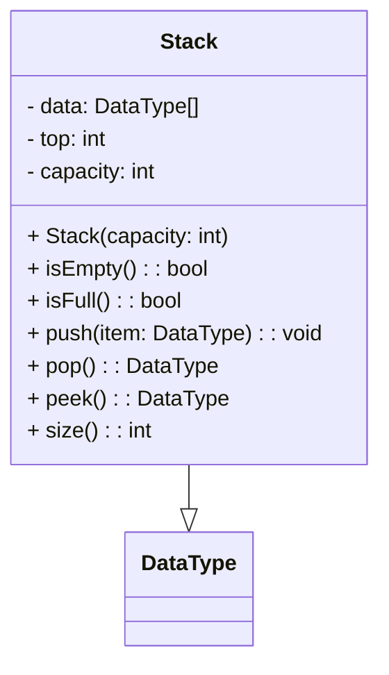

# Stack

<video src="https://www.youtube.com/watch?v=KcT3aVgrrpU" preview-src="stack1.jpeg" width="900"  />

## Overview

<note>

**Definition**

A stack is a data structure that stores items in a first-in, last-out (FILO) order. In a FILO data structure, the first item added to the stack will be the last item removed. This is equivalent to the requirement that once a new element is added, all elements that were added before have to be removed before the new element can be removed.

</note>

### Use Cases

<procedure>

Stacks are used to store data in the order in which they occur. This is useful for many reasons, such as:   

Storing the order of:
- operations in a calculator
- web pages visited in a web browser
- function calls in a program
- undo operations in a program
- transactions in a bank account
</procedure>

<table>
<tr>
<td>Pros</td><td>Cons</td>
</tr>
<tr>
<td>

- easy to implement.
- easy to use.
- efficient.
- fast.
- simple.
- flexible.
- versatile.
- useful.
- powerful.
</td>
<td>

- not thread-safe.
- not synchronized.
- not concurrent.
- not atomic.
- not scalable.
- not distributed.
- not parallel.
- not asynchronous.
- not fault-tolerant.
- not distributed.
</td>
</tr>
</table>


## Implementation

<table style="none">
<tr>
<td colspan="2">

[//]: # (FIXME : ADD UML DIAGRAMS BACK IN)
[//]: # (```plantuml)

[//]: # (@startuml)

[//]: # (class Stack {)

[//]: # (  - data: DataType[])

[//]: # (  - top: int)

[//]: # (  - capacity: int)

[//]: # ()
[//]: # (  + Stack&#40;capacity: int&#41;)

[//]: # (  + isEmpty&#40;&#41;: boolean)

[//]: # (  + isFull&#40;&#41;: boolean)

[//]: # (  + push&#40;item: DataType&#41;: void)

[//]: # (  + pop&#40;&#41;: DataType)

[//]: # (  + peek&#40;&#41;: DataType)

[//]: # (  + size&#40;&#41;: int)

[//]: # (})

[//]: # (@enduml)

[//]: # (```)



</td>
<td colspan="4">

<deflist collapsible="true" default-state="collapsed">
<def title="Key Elements" default-state="collapsed">
    <deflist>
        <def title="data">is an array to store the elements of the stack.</def>
        <def title="top">is an integer representing the index of the top element in the stack.</def>
        <def title="capacity">is the maximum number of elements the stack can hold.</def>
    </deflist>
</def>
<def title="Methods">
    <deflist>
        <def title="isEmpty()">to check if the stack is empty</def>
        <def title="isFull()">to check if the stack is full</def>
        <def title="push(item)">to push an item onto the stack</def>
        <def title="pop()">to pop the top item off the stack</def>
        <def title="peek()">to view the top item without removing it</def>
        <def title="size()">to get the current size of the stack</def>
    </deflist>
</def>
</deflist>
</td>
</tr>
<tr>
<td colspan="6">


</td>
</tr>
<tr>
<td colspan="2">
<tip>
<b>Push</b>
<p>Pushing an item onto a stack is a simple operation. The item is added to the top of the stack. This is done by adding the item to the top of the stack and then incrementing the top of the stack.</p>
</tip>
</td>
<td colspan="2">
<tip>
<b>Peek</b>
<p>Peeking at the top of a stack is a simple operation. The item at the top of the stack is returned. This is done by returning the item at the top of the stack.</p>
</tip>
</td>
<td colspan="2">
<tip>
<b>Pop</b>
<p>Popping an item off of a stack is a simple operation. The item is removed from the top of the stack. This is done by decrementing the top of the stack and then removing the item from the top of the stack.</p>
</tip>
</td>
</tr>
</table>


### Sample Code

<procedure>

```c++
#include <iostream>
#include <stack>

int main() {
    std::stack<int> stack;

    stack.push(1);
    stack.push(2);
    stack.push(3);

    std::cout << "Stack size: " << stack.size() << std::endl;

    std::cout << "Stack top: " << stack.top() << std::endl;

    stack.pop();

    std::cout << "Stack size: " << stack.size() << std::endl;

    std::cout << "Stack top: " << stack.top() << std::endl;

    return 0;
}

```

<br/>

```text
// Output

Stack size: 3
Stack top: 3
Stack size: 2
Stack top: 2
```
{ collapsible="true" }

</procedure>

## Building your own Stack

<procedure>
<p>Flowchart and method pseudocode...</p>
<tabs>
<tab title="Flow">


{ center="true" }
</tab>
<tab title="Push">

```text
1. Check if the stack is full.
2. If the stack is full, throw an exception.
3. If the stack is not full, increment the top of the stack.
4. Add the item to the top of the stack.
```
</tab>
<tab title="Peek">

```text
1. Check if the stack is empty.
2. If the stack is empty, throw an exception.
3. If the stack is not empty, return the item at the top of the stack.
```
</tab>
<tab title="Pop">

```text
1. Check if the stack is empty.
2. If the stack is empty, throw an exception.
3. If the stack is not empty, remove the item from the top of the stack.
4. Decrement the top of the stack.
```
</tab>
<tab title="Size">

```text
1. Return the top of the stack.
```
</tab>
<tab title="isEmpty">

```text
1. Return true if the top of the stack is equal to -1.
2. Return false otherwise.
```
</tab>
<tab title="isFull">

```text
1. Return true if the top of the stack is equal to the capacity of the stack minus 1.
2. Return false otherwise.
```
</tab>
</tabs>
</procedure>

### Considerations

<procedure>


<deflist collapsible="true">
<def title="Overflow">error can be thrown when calling <code>push</code> on a full stack</def>
<def title="Underflow">error can be thrown when calling <code>pop</code> on an empty stack</def>
<def title="stackOverflow">


{ center="true" }

</def>
</deflist>

</procedure>


### Time &amp; Space Complexity

```tex
\begin{array}{lclclclclcl}
\hline
\textbf{Operation} & \textbf{Worst Case} & \textbf{Avg Case} & \textbf{Best Case} \\
\hline
\text{Push} & \mathcal{O}(1) & \mathcal{O}(1) & \mathcal{O}(1) \\
\hline
\text{Peek} & \mathcal{O}(1) & \mathcal{O}(1) & \mathcal{O}(1) \\
\hline
\text{Pop} & \mathcal{O}(1) & \mathcal{O}(1) & \mathcal{O}(1) \\
\hline
\text{Size} & \mathcal{O}(1) & \mathcal{O}(1) & \mathcal{O}(1) \\
\hline
\text{isEmpty} & \mathcal{O}(1) & \mathcal{O}(1) & \mathcal{O}(1) \\
\hline
\text{isFull} & \mathcal{O}(1) & \mathcal{O}(1) & \mathcal{O}(1) \\
\hline
\end{array}
```


[//]: # (## References)

[//]: # ()
[//]: # (- [Stacks]&#40;https://en.wikipedia.org/wiki/Stack_&#40;abstract_data_type&#41;&#41;)

[//]: # (- [Stacks]&#40;https://www.geeksforgeeks.org/stack-data-structure/&#41;)

[//]: # (- [Stacks]&#40;https://www.tutorialspoint.com/data_structures_algorithms/stack_algorithm.htm&#41;)

[//]: # (- [Stacks]&#40;https://www.programiz.com/dsa/stack&#41;)

[//]: # (- [Stacks]&#40;https://www.interviewbit.com/tutorial/stacks-and-queues/&#41;)

[//]: # (- [Stacks]&#40;https://www.hackerearth.com/practice/data-structures/stacks/basics-of-stacks/tutorial/&#41;)


