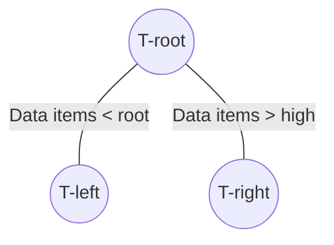
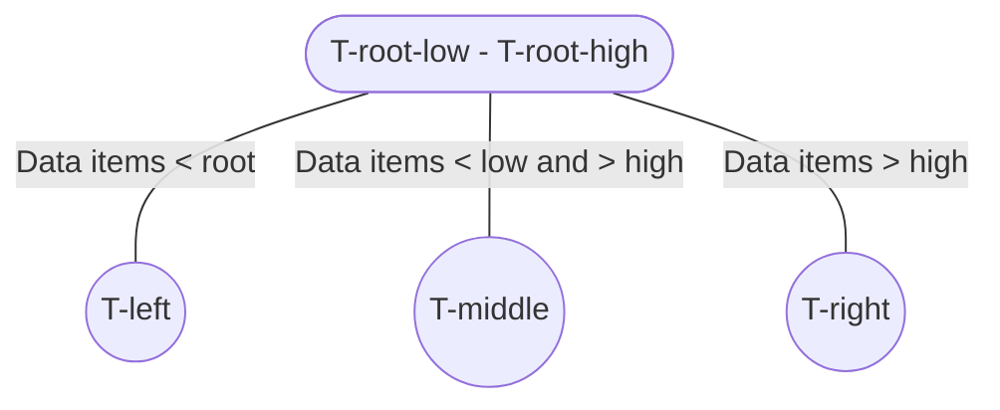
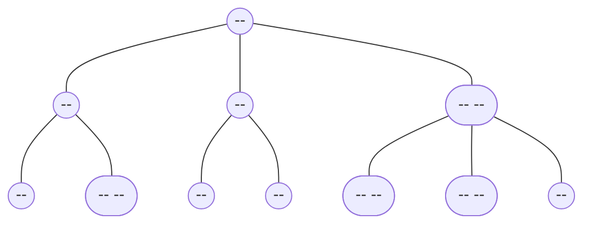

# 2-3 Trees

<table>
<tr>
<td>2-node</td><td>3-node</td>
</tr>
<tr>
<td>

```mermaid

flowchart TB
    id1(( T-root )) ---| Data items < root | id2(( T-left ))
    id1 ---| Data items > high | id3((T-right))

```

</td>
<td>

```mermaid

flowchart TB
    id1([ T-root-low  -  T-root-high ]) ---| Data items < root | id2(( T-left ))
    id1 ---| Data items < low and > high | id3((T-middle))
    id1 ---| Data items > high | id4((T-right))

```

</td>
</tr>

<tr>
<td colspan="2">

```mermaid

flowchart TB
    id1(( -- )) ---|  | id2(( -- ))
    id1 ---|  | id3(( -- ))
    id1 ---|  | id4([ -- -- ])
    id2 ---|  | id5(( -- ))
    id2 ---|  | id6([ -- -- ])
    id3 ---|  | id7(( -- ))
    id3 ---|  | id8(( -- ))
    id4 ---|  | id9([ -- -- ])
    id4 ---|  | id10([ -- -- ])
    id4 ---|  | id11(( -- ))

```
Sample 2-3 Tree
</td>
</tr>
</table>

